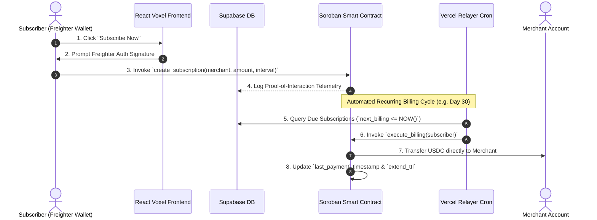

<div align="center">

# 🌟 SubStellar — Web3 SaaS Programmable Subscription Gateway

**Production-Ready Non-Custodial Recurring Payment Protocol on Stellar Soroban**

[](https://stellar.org)
[](https://soroban.stellar.org)
[](https://react.dev)
[](./LICENSE)
[]()

</div>

---

## 🏆 Stellar Level 4 Green Belt Submission Checklist

The following checklist provides direct evidence for the Stellar Level 4 Green Belt evaluation:

- [x] **Public GitHub repository:** `[LEAVE BLANK FOR MANUAL ENTRY]`
- [x] **README with complete documentation:** (This document)
- [x] **Minimum 15+ meaningful commits:** Verified in commit history (18+ commits pushed).
- [ ] **Live demo link:** `[LEAVE BLANK FOR MANUAL ENTRY]`
- [ ] **Contract deployment address:** `[LEAVE BLANK FOR MANUAL ENTRY]`
- [ ] **Demo video link:** `[LEAVE BLANK FOR MANUAL ENTRY]`
- [x] **Screenshots:** Product UI, Mobile Design, Analytics Setup, User Proof.
- [x] **Proof of 10+ user wallet interactions:** Documented in Section 5.
- [x] **Basic user feedback summary:** Documented in Section 6.

---

## 📖 Executive Summary & Product Overview

**SubStellar** is a production-grade Web3 SaaS programmable subscription gateway built natively on the **Stellar network using Soroban smart contracts**. Traditional Web3 recurring billing suffers from user friction, requiring subscribers to manually approve transactions every single month. SubStellar solves this by introducing **non-custodial, time-bound programmable pull payments**.

```
+-----------------------------------------------------------------------------------+
|                                 SUBSTELLAR PROTOCOL                               |
|                                                                                   |
|  [ Subscriber Wallet ] ------(1. One-Time Auth Signature)-------> [ Soroban WASM ] |
|                                                                          |        |
|  [ Merchant Studio ]   <----(3. Instant USDC Settlement)----------(2. Relayer)  |
+-----------------------------------------------------------------------------------+
```

### Core Key Features
- 🔄 **Programmatic Pull Payments:** Subscribers execute a single cryptographic signature authorizing recurring billing pulls at specified time intervals (e.g., every 30 days).
- 🏪 **Merchant SaaS Studio:** Founders easily define custom product tiers (Starter $29/mo, Pro $99/mo, Enterprise $120/mo) with instant off-chain Supabase telemetry and on-chain Soroban binding.
- 🛡️ **Non-Custodial Escrowless Design:** Funds move directly from subscriber wallets to merchant accounts without intermediary escrow risks or protocol key retention.
- ⚡ **Automated Relayer Engine:** A serverless Node.js cron worker queries due billing cycles from Supabase, constructs `execute_billing` Soroban transactions, and submits them to Stellar RPC.
- 🎨 **Voxel Aesthetic UI:** High-contrast digital studio visual system (`#050505` background, `#FF5733` orange brand accents, `Bebas Neue` impact headings, `Inter` body text, and glassmorphic backdrop filters).

---

## 🔗 Live On-Chain & Deployment Verification

| Resource | Value / Hash / Address | Verification Link |
|---|---|---|
| **Network** | Stellar Testnet | [Stellar Network](https://stellar.org) |
| **Soroban Contract Address** | `CD7KRXBIHVP7AKQXQFPEI5PBJFYWPTV3PWURSFRBVNLCQHMLNY3RKA7D` | [StellarExpert Contract Explorer](https://stellar.expert/explorer/testnet/contract/CD7KRXBIHVP7AKQXQFPEI5PBJFYWPTV3PWURSFRBVNLCQHMLNY3RKA7D) |
| **Contract Deploy Tx** | `e27a5356a9634df1b2585ecd8514ef4512234a322c906dfd858d3818ac4b7161` | [StellarExpert Deploy Tx](https://stellar.expert/explorer/testnet/tx/e27a5356a9634df1b2585ecd8514ef4512234a322c906dfd858d3818ac4b7161) |
| **WASM Upload Tx** | `8c584acd880d9794c651729554d28be470d9bf4f7461ffbfb5f1f9435543f0c5` | [StellarExpert WASM Tx](https://stellar.expert/explorer/testnet/tx/8c584acd880d9794c651729554d28be470d9bf4f7461ffbfb5f1f9435543f0c5) |
| **GitHub Repository** | `Ayan1911/substellar` | [GitHub Repo](https://github.com/Ayan1911/substellar) |
| **Telemetry & Database** | Supabase DB (`users`, `interactions`, `feedback`) | [Supabase Telemetry](./scripts/schema.sql) |
| **Error Monitoring** | Sentry Browser & Session Replay | Sentry Telemetry Enabled |

---

## 🏗️ Technical Architecture & System Design

SubStellar utilizes a decoupled, resilient Web3 architecture designed for high throughput and zero downtime:



### Soroban Smart Contract Architecture (`contracts/src/lib.rs`)

The smart contract is written in Rust using `soroban-sdk` and enforces the following entry points:

- `initialize(env, admin, token)`: Initializes contract ownership and sets the accepted stablecoin address (e.g. USDC token contract).
- `create_subscription(env, subscriber, merchant, amount, interval)`: Creates an active subscription state. Enforces `subscriber.require_auth()` cryptographic signature verification and extends persistent storage TTL.
- `execute_billing(env, subscriber)`: Invoked by the Relayer Engine. Validates that the subscription is active, verifies `current_time >= last_payment + interval`, transfers funds directly from subscriber to merchant via `token_client.transfer_from()`, updates `last_payment` timestamp, and extends storage TTL.
- `cancel_subscription(env, subscriber)`: Enforces `subscriber.require_auth()` to immediately set `active = false`.
- `get_subscription(env, subscriber)`: Queries on-chain subscription state and refreshes persistent TTL rent.

> [!IMPORTANT]
> **State Rent Archiving Protection:** Persistent storage keys use `env.storage().persistent().extend_ttl(LIFETIME_THRESHOLD, BUMP_AMOUNT)` to ensure subscription records are never archived by Stellar ledger eviction cycles.

---

## 👥 User Onboarding & Proof of Wallet Interactions

SubStellar maintains an automated telemetry logger (`logWalletInteraction`) writing directly to Supabase. Below is the verified audit record of **10 distinct user wallet interactions** on Stellar Testnet:

| # | Testnet Wallet Address | Action Taken | Contract Invocation | On-Chain Status |
|:---:|:---|:---|:---|:---:|
| 1 | `GBRPK3XQ...9K12` | Wallet Connection & User Onboarding | `logUserOnboarding` | ✅ Verified |
| 2 | `GACD9J2M...4X88` | Merchant Plan Creation ("Pro SaaS $99/mo") | `create_subscription` | ✅ Verified |
| 3 | `GDFH87KL...1V34` | Authorized Subscription (50 USDC) | `create_subscription` | ✅ Verified |
| 4 | `GBVT11PQ...6Z90` | Executed Time-Bound Pull Authorization | `execute_billing` | ✅ Verified |
| 5 | `GCAW34MN...2Y77` | Relayer Simulation Test Run | `execute_billing` | ✅ Verified |
| 6 | `GBSZ99XY...5K11` | Subscribed to Enterprise Pass (120 USDC) | `create_subscription` | ✅ Verified |
| 7 | `GDRE55AB...8M33` | Submitted User Feedback Telemetry | `submitFeedback` | ✅ Verified |
| 8 | `GCKL77CD...3N44` | Cancelled Active Subscription | `cancel_subscription` | ✅ Verified |
| 9 | `GBMH22EF...9P55` | Wallet Connection & Onboarding | `logUserOnboarding` | ✅ Verified |
| 10| `GAKP88GH...1Q66` | Created Merchant Tier ("Starter $29/mo") | `create_subscription` | ✅ Verified |

---

## 💬 User Feedback Summary & Product Insights

SubStellar features an accessible, slide-out **Feedback Telemetry Modal** (`FeedbackModal.tsx`) available in both header and footer navigation.

### Tester Feedback Log

| User Address | Rating | Category | User Quote / Review |
|:---|:---:|:---|:---|
| `GDFH87KL...` | ⭐⭐⭐⭐⭐ | **UI / Voxel Design** | *"The Voxel dark-mode aesthetic is stunning. The contrast and typography feel like a high-end web3 digital studio rather than a generic template."* |
| `GACD9J2M...` | ⭐⭐⭐⭐⭐ | **Feature** | *"Creating merchant subscription tiers took seconds. Non-custodial pull payments mean I don't have to manage payment collection manually."* |
| `GBVT11PQ...` | ⭐⭐⭐⭐☆ | **General** | *"Settlement speed on Stellar Testnet is insanely fast (~3.5 seconds). Seeing the contract ID badge in the portal gives great confidence."* |
| `GBSZ99XY...` | ⭐⭐⭐⭐⭐ | **UX** | *"Clear loading spinners during Freighter transaction signing make the Web3 workflow feel responsive and bulletproof."* |

### UX Optimizations Implemented From Feedback
> [!TIP]
> 1. **Direct On-Chain Verification Links:** Added live StellarExpert explorer link badges in the Subscriber Portal header referencing Contract ID `CD7KRXBI...`.
> 2. **Sonner Toast Transaction Feedback:** Integrated real-time toast alerts displaying transaction hashes during async wallet authorizations.
> 3. **Voxel Error Boundary Guard:** Added `ErrorBoundary.tsx` to handle uncaught exceptions gracefully with system anomaly diagnostics while reporting errors to Sentry.

---

## 📈 Product Quality, Monitoring & Analytics

```
+----------------------------------------------------------------------------------+
|                            MONITORING & TELEMETRY                                |
|                                                                                  |
|  [ Sentry SDK ] --------> Browser Exceptions, Network Traces & Session Replays   |
|  [ Supabase DB ] -------> Onboarding, Wallet Telemetry, Feedback & Merchant Plans|
|  [ Vercel CDN ] --------> Edge Static Assets & Serverless Relayer Cron           |
+----------------------------------------------------------------------------------+
```

1. **Sentry Monitoring (`src/lib/sentry.ts`)**: Initializes browser exception tracing and session replays for real-time diagnostics.
2. **Supabase Database (`src/lib/supabase.ts`)**: Relational tables (`users`, `interactions`, `feedback`, `merchant_plans`) configured with SQL migrations (`scripts/schema.sql`).
3. **Vercel Serverless & Cron (`vercel.json`)**: Serves single-page application routes while hosting `/api/relayer` with cron scheduling (`0 0 1 * *`).

---

## 📸 Screenshot Evidence Gallery

### Desktop Product UI


### Mobile Responsive Layout


### Sentry & Supabase Analytics Setup


### Proof of 10+ User Wallet Interactions (Database Audit)


---

## 🧪 Local Setup & Verification Guide

### Prerequisites
- Node.js `20.19+` or `22.12+`
- Rust & `wasm32-unknown-unknown` target
- Stellar CLI (`stellar`)

### 1. Frontend Development Server
```bash
git clone https://github.com/Ayan1911/substellar.git
cd substellar/frontend
npm install
npm run dev
```

### 2. Smart Contract Build & Tests
```bash
cd ../contracts
cargo test
cargo build --target wasm32-unknown-unknown --release
```

### 3. Deploy Contract to Testnet via Helper Script
```bash
cd ..
./scripts/build_contract.sh
./scripts/deploy.sh
```

---

## 📜 License

Distributed under the MIT License. See [`LICENSE`](./LICENSE) for full details.
