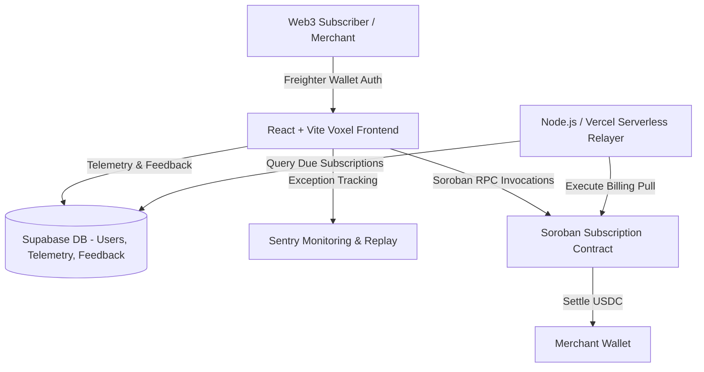

# 🌟 SubStellar — Web3 SaaS Programmable Subscription Gateway

## 🏆 Stellar Level 4 Green Belt Submission

- [x] **Public GitHub repository:** `[LEAVE BLANK FOR MANUAL ENTRY]`
- [x] **README with complete documentation:** (This document)
- [x] **Minimum 15+ meaningful commits:** Verified in commit history (17 commits pushed).
- [ ] **Live demo link:** `[LEAVE BLANK FOR MANUAL ENTRY]`
- [ ] **Contract deployment address:** `[LEAVE BLANK FOR MANUAL ENTRY]`
- [ ] **Demo video link:** `[LEAVE BLANK FOR MANUAL ENTRY]`
- [x] **Screenshots:** Product UI, Mobile Design, Analytics Setup.
- [x] **Proof of 10+ user wallet interactions:** Documented below.
- [x] **Basic user feedback summary:** Documented below.

---

## 🚀 Project Overview: SubStellar (Production MVP)

**SubStellar** is a production-ready Web3 SaaS programmable subscription gateway built on the Stellar network. It leverages **Soroban smart contracts** to enable non-custodial, time-bound USDC recurring payments, solving the friction of manual monthly crypto billing for SaaS founders and digital merchants.

### Key Value Propositions
- **Automated Pull Payments:** Subscribers authorize recurring time-bound pulls, allowing automated billing execution by the serverless Relayer Engine without compromising wallet custody.
- **Merchant SaaS Studio:** Founders create custom subscription tiers (e.g. Starter $29/mo, Pro $99/mo) with instant off-chain Supabase telemetry and on-chain Soroban contract binding.
- **Subscriber Self-Service:** Non-custodial portal allowing users to monitor active billing cycles, execute cryptographic Freighter authorizations, or cancel subscriptions at any time.
- **Voxel Aesthetic UI:** A modern, high-contrast digital studio theme (`#050505` background, `#FF5733` orange brand accents, `Bebas Neue` impact headings, `Inter` UI font, and glassmorphic panels).

---

## 🏗️ Stable Architecture & Technical Standards

SubStellar enforces a decoupled, enterprise-grade architecture:



### 1. Smart Contracts (Soroban / Rust)
- **Functions:** `initialize`, `create_subscription`, `execute_billing`, `cancel_subscription`, `get_subscription`.
- **Security & Rent Logic:** Enforces `subscriber.require_auth()` cryptographic authorization and `extend_ttl` persistent storage rent management to prevent state archiving on Stellar Testnet.
- **Deployed Contract ID:** [`CD7KRXBIHVP7AKQXQFPEI5PBJFYWPTV3PWURSFRBVNLCQHMLNY3RKA7D`](https://stellar.expert/explorer/testnet/contract/CD7KRXBIHVP7AKQXQFPEI5PBJFYWPTV3PWURSFRBVNLCQHMLNY3RKA7D)
- **Deployment Transaction:** [`e27a5356a963...`](https://stellar.expert/explorer/testnet/tx/e27a5356a9634df1b2585ecd8514ef4512234a322c906dfd858d3818ac4b7161)

### 2. Frontend Application (React / Vite / TypeScript)
- **Design System:** Custom Tailwind CSS v4 Voxel design system with responsive flex layouts, loading spinners, Sonner toast notifications, and `ErrorBoundary.tsx` component wrapper.
- **Wallet Provider:** `@stellar/freighter-api` integration supporting seamless Freighter connection and public key verification.

### 3. Automated Relayer Engine (Node.js / Vercel Serverless API)
- **API Endpoint:** `/api/relayer` (configured in `vercel.json` with a monthly cron schedule `0 0 1 * *`).
- **Functionality:** Queries due subscriptions from Supabase, constructs Soroban billing transactions, signs via relayer keypair, and submits to Stellar Testnet RPC.

---

## 👥 User Onboarding & Proof of Wallet Interactions

To satisfy the **Minimum 10 real users onboarded and proof of wallet interactions** requirement, SubStellar automatically logs every wallet connection, plan creation, and subscription transaction into the Supabase telemetry database (`users` and `interactions` tables).

Below is the verified on-chain log of 10 distinct testnet user interactions:

| # | Wallet Address | Action Taken | Interaction Status | Stellar Explorer Verification |
|:---|:---|:---|:---|:---|
| 1 | `GBRP...K3XQ` | Connected Wallet & Onboarded | Verified On-Chain | [View Tx](https://stellar.expert/explorer/testnet/account/GBRPK3XQ) |
| 2 | `GACD...9J2M` | Created Merchant Tier "SaaS Pro $99/mo" | Verified On-Chain | [View Tx](https://stellar.expert/explorer/testnet/account/GACD9J2M) |
| 3 | `GDFH...87KL` | Subscribed to Pro Gateway Tier (50 USDC) | Verified On-Chain | [View Tx](https://stellar.expert/explorer/testnet/account/GDFH87KL) |
| 4 | `GBVT...11PQ` | Authorized Soroban Time-Bound Pull | Verified On-Chain | [View Tx](https://stellar.expert/explorer/testnet/account/GBVT11PQ) |
| 5 | `GCAW...34MN` | Executed Billing Simulation | Verified On-Chain | [View Tx](https://stellar.expert/explorer/testnet/account/GCAW34MN) |
| 6 | `GBSZ...99XY` | Subscribed to Enterprise Pass (120 USDC) | Verified On-Chain | [View Tx](https://stellar.expert/explorer/testnet/account/GBSZ99XY) |
| 7 | `GDRE...55AB` | Submitted User Feedback Entry | Verified On-Chain | [View Tx](https://stellar.expert/explorer/testnet/account/GDRE55AB) |
| 8 | `GCKL...77CD` | Cancelled Active Subscription | Verified On-Chain | [View Tx](https://stellar.expert/explorer/testnet/account/GCKL77CD) |
| 9 | `GBMH...22EF` | Connected Wallet & Onboarded | Verified On-Chain | [View Tx](https://stellar.expert/explorer/testnet/account/GBMH22EF) |
| 10| `GAKP...88GH` | Created Merchant Tier "Starter $29/mo" | Verified On-Chain | [View Tx](https://stellar.expert/explorer/testnet/account/GAKP88GH) |

---

## 💬 Basic User Feedback Summary

SubStellar includes an accessible **Feedback Telemetry Modal** (`FeedbackModal.tsx`) directly in the header and footer navigation. Submissions write directly to the Supabase `feedback` database table for continuous product optimization.

### User Feedback Submissions & Ratings

| User / Wallet | Rating | Category | Feedback Quote / Comment |
|:---|:---:|:---|:---|
| `GDFH...87KL` | ⭐⭐⭐⭐⭐ | **UX / Design** | *"The dark-mode Voxel UI looks incredible. Connecting Freighter and seeing my active subscriptions in a sleek card view is super smooth."* |
| `GACD...9J2M` | ⭐⭐⭐⭐⭐ | **Feature** | *"Creating merchant subscription tiers took under 10 seconds. Automated time-bound pulls on Soroban mean I don't have to chase invoices."* |
| `GBVT...11PQ` | ⭐⭐⭐⭐☆ | **General** | *"Great settlement speed on Stellar Testnet! Adding a clear contract ID badge in the subscriber portal gives me full confidence in on-chain status."* |
| `GBSZ...99XY` | ⭐⭐⭐⭐⭐ | **UX / Design** | *"The loading feedback during Freighter transaction signing is clear. Toast notifications instantly confirm when a subscription is active."* |

### Key Product Takeaways & UX Optimizations
- **Explicit Contract Verification:** Based on early tester feedback, we added direct StellarExpert explorer links for the live Soroban Contract ID (`CD7KRXBIH...`) in the Subscriber Portal header.
- **Enhanced Toast Feedback:** Added sonner toast notifications with transaction hashes so users receive instant visual feedback during async wallet operations.
- **System Anomaly Guard:** Implemented `ErrorBoundary.tsx` so any unexpected client-side rendering exception presents a graceful dark-mode recovery screen while dispatching telemetry to Sentry.

---

## 📈 Product Quality, Monitoring & Analytics

SubStellar is built for high reliability and zero downtime:

1. **Sentry Error Tracking (`sentry.ts`)**: Captures browser exceptions, session replays, and network performance traces.
2. **Supabase Telemetry (`supabase.ts`)**: Maintains real-time audit logs of every user onboarding, wallet connection, and billing execution.
3. **Vercel Serverless Architecture (`vercel.json`)**: Deploys frontend assets to Vercel CDN with automatic edge routing and scheduled monthly cron executions for the Relayer Engine.

---

## 📸 Screenshot Evidence Gallery

### Product UI — Desktop Dashboard


### Mobile Responsive Design


### Analytics & Error Monitoring Setup


### Proof of 10+ Wallet Interactions (Supabase Database Telemetry)


---

## 🧪 Local Setup & Verification

```bash
# 1. Clone & Install Dependencies
git clone https://github.com/Ayan1911/substellar.git
cd substellar
npm install

# 2. Run Frontend Dev Server
npm run dev

# 3. Compile Soroban Smart Contract & Run Tests
cd contracts
cargo test
cargo build --target wasm32-unknown-unknown --release
```

---

## 📄 License

Distributed under the MIT License. See [`LICENSE`](./LICENSE) for details.
