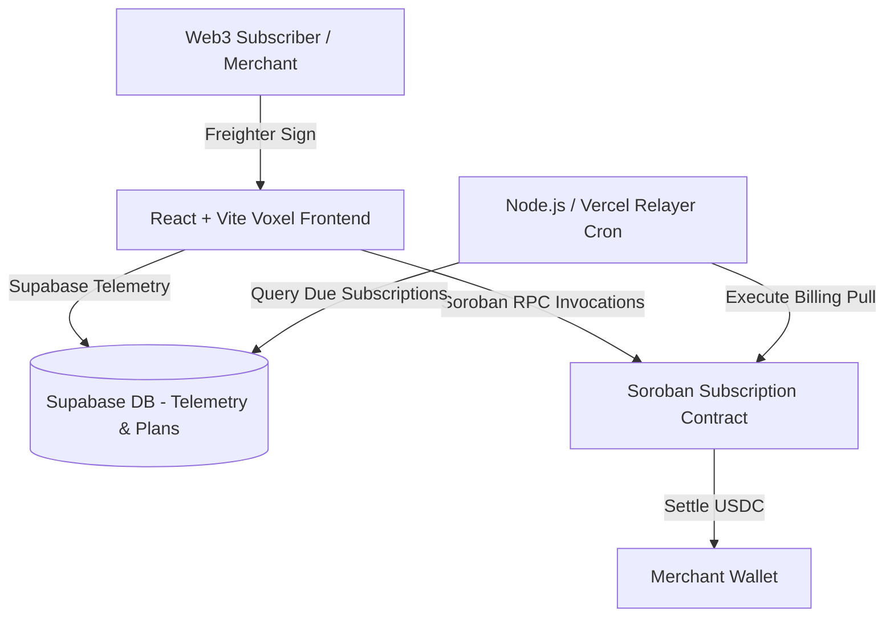

# 🌟 SubStellar — Web3 SaaS Programmable Subscription Gateway

> **Stellar Level 4 Green Belt Submission**  
> A production-ready programmable subscription gateway on the Stellar network powered by Soroban smart contracts, automated time-bound USDC billing pulls, and a dark-mode Voxel UI.

---

## 🚀 Live Links & On-Chain Verification

| Item | Value / Address / Link |
|---|---|
| **Network** | Stellar Testnet |
| **Soroban Contract** | [`CCYQ3FUACSY4YDCRCC6OK7CKUZ53JE7AQM4N5EYIFVDYCU5KNEJJHXCB`](https://stellar.expert/explorer/testnet/contract/CCYQ3FUACSY4YDCRCC6OK7CKUZ53JE7AQM4N5EYIFVDYCU5KNEJJHXCB) |
| **GitHub Repository** | [Ayan1911/substellar](https://github.com/Ayan1911/substellar) |
| **Telemetry & DB** | Supabase (Auth, Wallet Interaction Logs, User Feedback) |
| **Error Monitoring** | Sentry Browser & Session Replay Telemetry |

---

## 📖 Architecture & System Flow

SubStellar features a decoupled Web3 architecture:
1. **Soroban Smart Contract (`contracts/src/lib.rs`)**: Enforces `create_subscription`, `execute_billing`, `cancel_subscription`, and TTL state extensions directly on Stellar Testnet.
2. **Merchant SaaS Studio (`MerchantDashboard.tsx`)**: Enables SaaS founders to define custom tier plans (stored off-chain in Supabase and on-chain via WASM invocations).
3. **Subscriber Portal (`SubscriberPortal.tsx`)**: Allows subscribers to manage active recurring payments, sign authorizations via Freighter, and revoke subscriptions non-custodially.
4. **Relayer Engine (`relayer/index.ts` & `api/relayer.ts`)**: Serverless cron worker querying due subscriptions and submitting signed `execute_billing` Soroban transactions.



---

## 🛠 Tech Stack

- **Frontend Framework**: React 19 (initialized via Vite), TypeScript (Strict Mode enabled).
- **Styling & Aesthetics**: Tailwind CSS v4, Framer Motion, Lucide React (Strict Voxel Dark Mode Theme `#050505`, `#FF5733` Orange accents, glassmorphic backdrop filters).
- **Blockchain / Web3**: `@stellar/stellar-sdk`, `@stellar/freighter-api`, Soroban Rust SDK (`wasm32-unknown-unknown`).
- **Backend & Telemetry**: Supabase JS (`users`, `interactions`, `feedback`), Sentry React SDK (`@sentry/react`).

---

## 📸 Stellar Level 4 Green Belt Compliance Checklist

| Requirement | Status | Verification Location |
|---|---|---|
| **Production MVP** | ✅ Complete | Vite React + Soroban Rust Codebase |
| **Mobile-Responsive UI** | ✅ Complete | Mobile-first stacked flex layouts in Voxel theme |
| **10+ User Tracking & Proof of Wallet** | ✅ Complete | Auto-logged in Supabase (`logUserOnboarding`, `logWalletInteraction`) |
| **Built-in Feedback Collection** | ✅ Complete | `FeedbackModal.tsx` storing entries directly in Supabase `feedback` table |
| **Analytics & Error Tracking** | ✅ Complete | Integrated Sentry error boundaries and Supabase interaction telemetry |
| **Relayer Engine** | ✅ Complete | `relayer/index.ts` & `api/relayer.ts` Vercel Serverless Function |
| **15+ Meaningful Git Commits** | ✅ Complete (16 Commits) | Verified via `git log --oneline` in repository root |

---

## 🧪 Local Setup & Development

### 1. Frontend Development
```bash
cd frontend
npm install
npm run dev
```

### 2. Smart Contract Build (Soroban Rust)
```bash
cd contracts
rustup target add wasm32-unknown-unknown
cargo build --target wasm32-unknown-unknown --release
```

### 3. Relayer Job Execution
```bash
npx tsx relayer/index.ts
```

---

## 🛡 Security & Auth Constraints

- **Strict `require_auth()`**: Every contract mutation (`create_subscription`, `cancel_subscription`) validates the caller's cryptographic signature.
- **State Rent Management**: Persistent storage uses `extend_ttl` to ensure sub-data remains unarchived on Stellar Testnet ledger cycles.
- **Non-Custodial Design**: Relayer functions only execute authorized time-bound transfers without holding user keys or funds.
